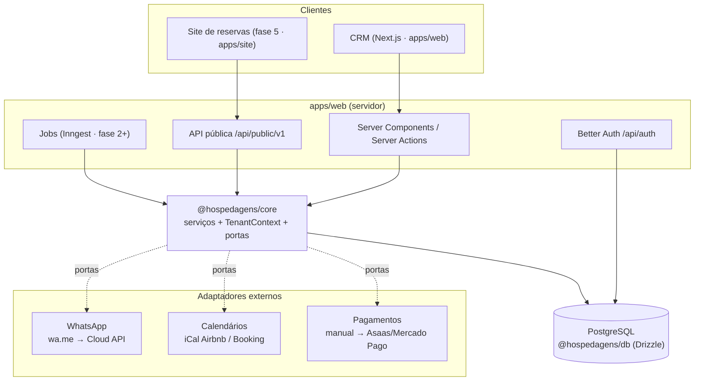

# Arquitetura

Este documento descreve **como o app é organizado e por quê**. As decisões
individuais ficam registradas em [`docs/adr`](./adr); o plano de entregas está
em [`ROADMAP.md`](./ROADMAP.md) e o modelo de dados em
[`DATA-MODEL.md`](./DATA-MODEL.md).

## Objetivo

Um CRM para quem aluga imóveis por temporada. Hoje atende um único anfitrião;
amanhã, vários clientes pagantes (SaaS). A arquitetura foi escolhida para
**começar simples sem precisar ser reescrita quando virar produto**.

## Princípios

1. **Multi-tenant desde o primeiro dia.** Cada cliente é uma `organization`.
   Toda tabela de negócio tem `organization_id`, e toda leitura ou escrita
   passa por um `TenantContext`. Você é o tenant nº 1
   ([ADR 0002](./adr/0002-multi-tenancy.md)).
2. **Monólito modular.** Um app Next.js com módulos de domínio bem separados.
   Não há microsserviços: é fácil de operar sozinho, e um módulo pode ser
   extraído no futuro se precisar.
3. **Regra de negócio fora da UI.** Os serviços ficam em `@hospedagens/core`,
   independentes de framework. Páginas, Server Actions, jobs, a API pública e
   o futuro site de reservas reutilizam a mesma camada.
4. **Integrações atrás de portas (ports & adapters).** WhatsApp, calendários
   e pagamentos são interfaces. Trocar `wa.me` pela API oficial, ou o registro
   manual por um gateway, não mexe em quem consome
   ([ADR 0003](./adr/0003-integracoes-por-adaptadores.md)).
5. **O CRM é a fonte da verdade da disponibilidade.** Airbnb e o site próprio
   leem e escrevem reservas através dele, nunca com bancos paralelos.
6. **Configurável por organização.** Etapas do funil, modelos de mensagem e
   fuso horário são dados, não código. Cada cliente do SaaS ajusta os seus.

## Visão geral



## Estrutura do repositório

```
apps/
  web/                    CRM (Next.js App Router)
    src/app/(auth)/       login e cadastro
    src/app/(app)/        área logada: dashboard, kanban, leads, ...
    src/app/api/          Better Auth e (futuro) API pública
    src/components/       layout (menu lateral) e ui (shadcn)
    src/modules/<mod>/    componentes e Server Actions de cada módulo
    src/lib/              auth, sessão/tenant, formatação
    scripts/seed.ts       dados de demonstração
packages/
  core/                   regras de negócio (sem React, sem Next)
  db/                     schema Drizzle, migrations, client, banco de teste
  config/                 tsconfig compartilhado
docs/                     arquitetura, roadmap, modelo de dados, ADRs
```

### Regra de dependência

```
app (páginas)  →  modules/*/actions  →  @hospedagens/core  →  @hospedagens/db
```

- A UI **nunca** acessa o banco diretamente para regras de negócio: ela chama
  um serviço do `core`. As exceções são a infraestrutura de autenticação
  (`lib/auth.ts` e `lib/session.ts`) e o script de seed.
- O `core` não importa nada de `next`, `react` ou `better-auth`.
- O `db` não conhece regras de negócio: só tabelas, tipos e conexão.

## Multi-tenancy

- **Modelo:** banco compartilhado, com `organization_id` em todas as tabelas de
  negócio. É o mais simples de operar e escala bem até milhares de clientes.
- **De onde vem o tenant:** `requireAppSession()` (`apps/web/src/lib/session.ts`)
  lê a sessão do Better Auth, confere a participação do usuário na tabela
  `member` e monta o `TenantContext`. **Nunca** se confia em `organizationId`
  vindo do cliente.
- **Como é garantido:** todo serviço do `core` recebe `ctx` e filtra por
  `ctx.organizationId`. Referências cruzadas (etapa, imóvel) são validadas
  contra o tenant, como em `createLead`. Os testes em
  `packages/core/src/tenancy.test.ts` cobrem esse isolamento.
- **Segunda camada (fase 7):** Row Level Security no Postgres, antes de abrir
  para clientes externos.

## Autenticação e organizações

- **Better Auth** com e-mail e senha e o plugin `organization`, que traz
  membros, papéis (`owner`/`admin`/`member`) e convites.
- No **cadastro**, o hook `user.create.after` cria a organização, o membro
  `owner` e as etapas padrão do funil (`bootstrapOrganization`). Ele também
  ativa a organização na sessão.
- Em cada **login**, o hook `session.create.before` abre a sessão na primeira
  organização do usuário.
- Organizações criadas pela API do plugin recebem as etapas padrão via
  `afterCreateOrganization`.

## Integrações

| Porta (`core`) | Agora | Depois |
|---|---|---|
| `MessagingProvider` | `WaMeLinkProvider`: abre a conversa em `wa.me` com mensagem preenchida | WhatsApp Cloud API (fase 4): enviar, receber por webhook, templates |
| `CalendarChannel` | — | `AirbnbIcalChannel` (fase 2): importa o iCal a cada 15 min. Exportação de iCal do CRM para o Airbnb bloquear datas |
| `PaymentProvider` | — | Registro manual (fase 3). Depois Asaas ou Mercado Pago: Pix com baixa por webhook |

**Site de reservas (fase 5):** ele vai consumir `/api/public/v1`
(disponibilidade, cotação, pedido de reserva), autenticado por chave de API por
organização. No curto prazo, o mesmo endpoint de leads pode receber os cliques
do botão "WhatsApp" do site WordPress atual.

## Jobs e tarefas assíncronas

A partir da fase 2 entra o **Inngest**: sincronização de iCal, processamento de
webhooks (WhatsApp, pagamentos) e envio de campanhas. Os jobs chamam os mesmos
serviços do `core` com um `TenantContext` de sistema.

## Convenções de dados

- Dinheiro em **centavos (inteiro)**, sempre BRL por enquanto.
- Datas de estadia (check-in/out) como `date` sem fuso; momentos (mensagens,
  pagamentos) como `timestamptz`. A exibição usa o fuso da organização (padrão
  `America/Sao_Paulo`).
- Telefones em E.164 sem `+` (`5511987654321`), normalizados no `core`.
- IDs textuais (UUID) gerados pela aplicação.

## Segurança e LGPD

- Segredos só em variáveis de ambiente (`.env` local, Vercel em produção).
- Dados pessoais de hóspedes ficam restritos ao tenant. CPF e documentos só
  serão guardados quando houver necessidade (contrato e nota fiscal) e com
  base legal.
- Fase 7: exportação e exclusão de dados por titular, termos de uso e
  política de privacidade, e registro de auditoria (`audit_log`).

## Deploy e operação

- **Vercel** (região `gru1`, São Paulo) para o app e **Neon** (Postgres, região
  São Paulo) para o banco. Branches de preview do Neon por PR quando fizer
  sentido.
- Migrations com `drizzle-kit` (`pnpm db:generate` e `pnpm db:migrate`). A CI
  falha se o schema mudar sem uma migration nova.
- Observabilidade a partir da fase 1: Sentry (erros) e logs estruturados.
