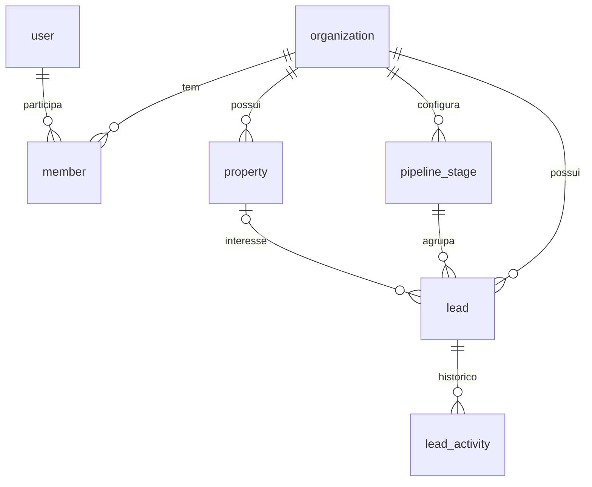

# Modelo de dados

O schema fica em `packages/db/src/schema/` (um arquivo por domínio) e as
migrations SQL em `packages/db/drizzle/`. Para alterar:
edite o schema → `pnpm db:generate` → revise o SQL → `pnpm db:migrate`.

## Convenções

| Regra | Exemplo |
|---|---|
| Toda tabela de negócio tem `organization_id` (FK `organization`, `on delete cascade`) e índice começando por ele | `lead_org_stage_idx (organization_id, stage_id, board_position)` |
| PK textual (UUID gerado pela aplicação) | `id text primary key` |
| `created_at` / `updated_at` como `timestamptz` | `updated_at` atualizado pelo Drizzle (`$onUpdate`) |
| Dinheiro em centavos (`integer`) | `base_price_cents = 65000` → R$ 650,00 |
| Datas de estadia como `date` (sem fuso); momentos como `timestamptz` | `desired_check_in date`, `last_message_at timestamptz` |
| Telefone em E.164 sem `+` | `5511987654321` |
| Colunas em `snake_case` no banco, `camelCase` no TypeScript | `stage_id` ↔ `stageId` |

## Implementado (fase 0)

### Identidade e tenancy (Better Auth)

| Tabela | Para quê |
|---|---|
| `user` | Pessoa que acessa o app. Inclui `job_title` (cargo) e `image` (foto) |
| `session` | Sessões de login. `active_organization_id` = tenant ativo |
| `account` | Credenciais (senha com hash) e, no futuro, logins sociais |
| `verification` | Tokens de verificação de e-mail e redefinição de senha |
| `organization` | **Tenant.** Cada cliente do SaaS (no início, só você) |
| `member` | Usuário ↔ organização, com papel `owner` / `admin` / `member` |
| `invitation` | Convites para entrar numa organização (fase 7) |

### Negócio

**`property`**: imóvel
`name`, `slug` (único por organização), `address`, `city`, `max_guests`,
`bedrooms`, `base_price_cents`, `ical_export_token` (URL secreta do iCal que o
Airbnb vai assinar na fase 2), `is_active`.

**`pipeline_stage`**: etapa do funil, configurável por organização
`name`, `position`, `color` (chave da paleta), `kind` (`open` | `won` | `lost`).
Etapas padrão: Novo lead → Em conversa → Pronto para fechar → Aguardando
pagamento → Fechado (`won`) / Perdido (`lost`).

**`lead`**: pessoa interessada
`name`, `phone`, `email`, `source` (`whatsapp` | `site` | `airbnb` |
`instagram` | `indicacao` | `outro`), `property_of_interest_id`, `stage_id`,
`board_position` (ordem no Kanban; maior = mais acima), `desired_check_in`,
`desired_check_out`, `guests`, `birthday`, `notes`, `lost_reason`,
`last_message_at`, `owner_user_id`.

**`lead_activity`**: linha do tempo do lead
`type` (`created` | `stage_changed` | `note` | `message` | `call`),
`payload jsonb`, `actor_user_id`, `created_at`.

### Configurações (fase 1, bloco 2)

**`organization_settings`**: preferências da organização, uma linha por
organização. Sem linha, valem os padrões.
`organization_id` (PK), `time_zone` (IANA, padrão `America/Sao_Paulo`). Fica
fora da tabela `organization` do Better Auth de propósito.

**`message_template`**: modelos de mensagem do WhatsApp.
`stage_id` nulo indica o modelo padrão da organização; com etapa, é o modelo
daquela etapa. A constraint única `(organization_id, stage_id)` com
`NULLS NOT DISTINCT` garante um modelo por etapa e um único padrão. Excluir a
etapa apaga o modelo dela (`on delete cascade`).

**Regras do funil:**
- "Fechado" (`won`) e "Perdido" (`lost`) ficam sempre no fim e não podem ser
  excluídas.
- Etapas novas são `open` e entram antes delas.
- O funil precisa de pelo menos uma etapa aberta.
- Excluir uma etapa com leads exige escolher o destino; cada lead movido
  ganha um `stage_changed` com `reason: "stage_deleted"`.

> Datas importantes do lead: o aniversário fica em `lead.birthday`; a última
> estadia virá das reservas (fase 2). Uma tabela própria de datas só será
> criada se surgir necessidade de datas livres com lembrete.

## Planejado

| Tabela | Fase | Campos principais |
|---|---|---|
| `api_key` | 1 | `organization_id`, `name`, `hash`, `last_used_at` (API pública / site) |
| `reservation` | 2 | `property_id`, `lead_id`, `channel` (`direct`/`airbnb`/`booking`), `check_in`, `check_out`, `guests`, `status` (`hold`/`confirmed`/`cancelled`/`completed`), `total_cents`, `external_uid` |
| `calendar_feed` | 2 | `property_id`, `channel`, `import_url`, `last_synced_at`, `last_error` |
| `transaction` | 3 | `kind` (`income`/`expense`), `amount_cents`, `competence_date`, `due_date`, `paid_at`, `method` (`pix`/`cartao`/`transferencia`/`repasse_airbnb`), `status`, `reservation_id`, `property_id`, `external_charge_id` |
| `conversation` / `message` | 4 | `lead_id`, `channel`, `external_id`, `direction` (`in`/`out`), `body`, `sent_at`, `status` |
| `campaign` / `campaign_recipient` | 6 | segmento, modelo, agendamento, métricas por destinatário |
| `audit_log` | 7 | `actor_user_id`, `action`, `entity`, `entity_id`, `diff` |

## Métricas do dashboard

Definições fixas, para que os números signifiquem a mesma coisa em todas as
telas e relatórios:

| Métrica | Definição |
|---|---|
| Leads por etapa | `count(lead)` agrupado por `stage_id` (somente da organização) |
| Leads em aberto | soma das etapas com `kind = open` |
| **Faturamento do mês** (fase 3) | soma de `transaction.amount_cents` com `kind = income`, sem cancelados, e `competence_date` no mês corrente (fuso da organização) |
| **Recebidos** (fase 3) | soma das receitas com `paid_at` no mês corrente |
| **A receber** (fase 3) | soma das receitas com `status` pendente ou vencido (qualquer vencimento) |
| Ocupação (fase 2) | noites reservadas ÷ noites disponíveis no período, por imóvel |
